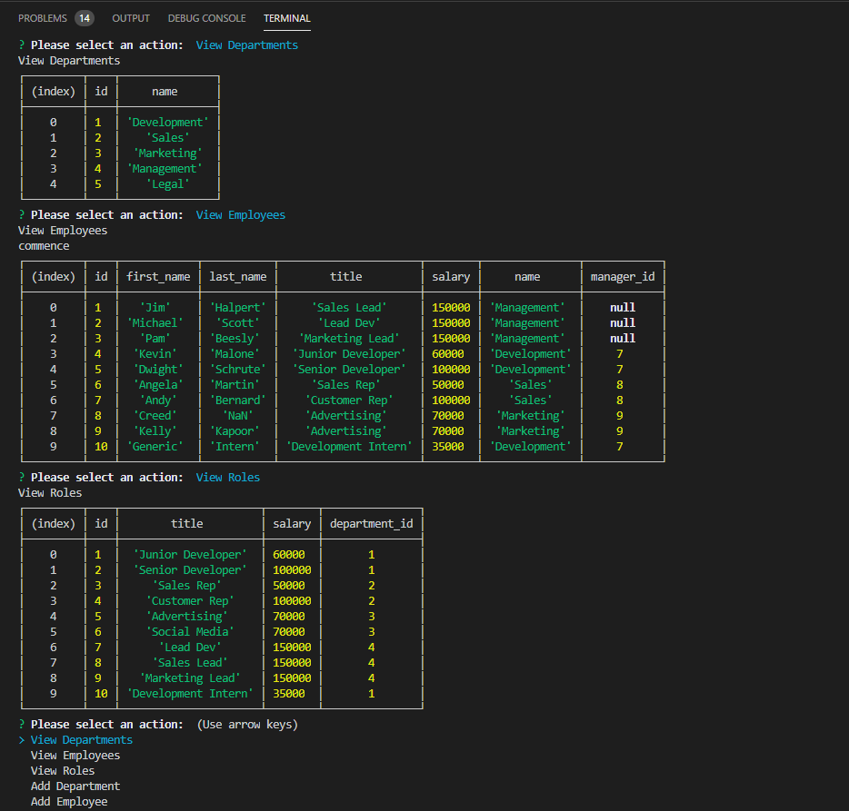

# SQl Employee Directory

## Table of Contents
> - [Description](#Description)
> - [Keywords](#Keywords)
> - [Contributors](#Contributors)
> - [Usage](#Usage)
> - [Installation](#Installation)
> - [Test](#Testing)
> - [License](#License)
> - [Deployment](#Deployment)
> - [Questions](#Questions)

## Description
>SQL Employee Database CLI Application

## Keywords
>*NodeJS, Express, SQL, CRUD*

## Contributors
>Liam Mackinnon

## Usage 
>node server.js

## Installation
>*npm i*

## Testing
>

## License
>Unlicense

## Deployment
Live Recording?: https://drive.google.com/file/d/1Hr6M9YBK8zI9p5VxjzugGwD7h59gR_lu/view  

Screenshot?: Yes

### Questions
>If you have any further questions about the application:
>Email: lmackinnon.inbox@gmail.com
>
>GitHub: www.github.com/liam-mack
